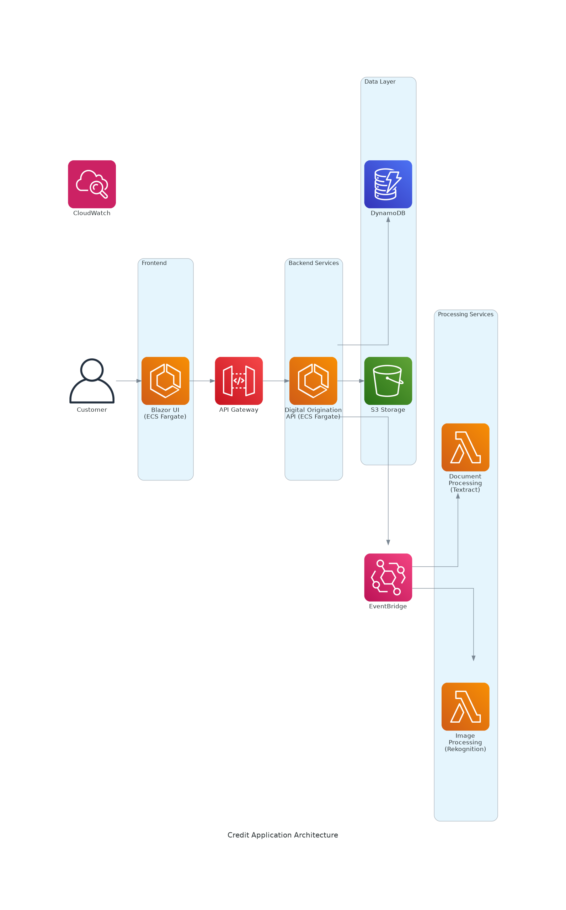

# Credit Application Prototype - Architecture & Sprint Plan

## Executive Summary

This document outlines the high-level architecture and 2-week sprint plan for a digital credit application prototype. The solution leverages modern cloud-native technologies on AWS to demonstrate improved customer experience through automated document processing and real-time application status updates.

## High-Level Architecture



### Architecture Components

#### Frontend Layer
- **Blazor UI on ECS Fargate**: Modern web application providing customer-facing credit application form
- **API Gateway**: Secure entry point for all API calls with rate limiting and authentication

#### Backend Services
- **Digital Origination Microservice**: Core business logic API running on ECS Fargate
  - Handles application submission and status management
  - Orchestrates document processing workflows
  - Manages customer data and application state

#### Data Layer
- **Amazon DynamoDB**: NoSQL database for application data and processing status
- **Amazon S3**: Secure storage for uploaded documents (payslips, ID documents, selfies)

#### Event-Driven Processing
- **Amazon EventBridge**: Central event bus for microservice communication
- **Document Processing Lambda**: Serverless function using Amazon Textract for income extraction
- **Image Processing Lambda**: Serverless function using Amazon Rekognition for face comparison

#### Cross-Cutting Concerns
- **Amazon CloudWatch**: Centralized logging, monitoring, and alerting

### Technology Stack

- **Runtime**: .NET 8 LTS on Linux ARM64 (Graviton3)
- **Frontend**: ASP.NET Core Blazor Server
- **Backend API**: ASP.NET Core Web API
- **Infrastructure**: AWS CDK with C#
- **Database**: Amazon DynamoDB with .NET SDK
- **File Storage**: Amazon S3 with lifecycle policies
- **Compute**: ECS Fargate (containers) + AWS Lambda (serverless)

## Event-Driven Architecture Flow

### 1. Application Submission
```
Customer → Blazor UI → API Gateway → Digital Origination API
                                           ↓
                                    Store in DynamoDB + S3
                                           ↓
                                    Publish "ApplicationSubmitted" event
```

### 2. Document Processing
```
EventBridge → Document Processing Lambda → Textract → Extract Income Data
                                              ↓
                                    Update DynamoDB with results
                                              ↓
                                    Publish "DocumentProcessed" event
```

### 3. Image Processing
```
EventBridge → Image Processing Lambda → Rekognition → Face Comparison
                                           ↓
                                 Update DynamoDB with results
                                           ↓
                                 Publish "ImageProcessed" event
```

### 4. Status Updates
```
Processing Events → Digital Origination API → Update Application Status
                                                      ↓
                                              Notify Customer via UI
```

## Key Benefits

### Customer Experience
- **Instant application submission** with real-time status updates
- **Automated data extraction** from documents (no manual entry)
- **Secure face verification** for identity confirmation
- **Mobile-responsive** Blazor interface

### Technical Advantages
- **Serverless document processing** - scales automatically, pay-per-use
- **Event-driven architecture** - loose coupling, high resilience
- **Container-based APIs** - consistent deployment, easy scaling
- **Infrastructure as Code** - version controlled, repeatable deployments

### Cost Optimization
- **ARM64 Graviton processors** - 20-34% cost savings vs x86
- **Linux containers** - no Windows licensing fees
- **Serverless Lambda** - zero cost when idle
- **DynamoDB on-demand** - pay only for actual usage

## 2-Week Sprint Plan

### Sprint Overview
**Goal**: Deliver working prototype demonstrating end-to-end credit application flow with automated document processing.

### Week 1: Foundation & Core Services

#### Days 1-2: Infrastructure Setup
- **CDK Project Setup**
  - Initialize AWS CDK project with C#
  - Define core infrastructure stack (VPC, security groups, IAM roles)
  - Set up DynamoDB table and S3 bucket
  - Deploy ECS cluster with Fargate configuration

- **Development Environment**
  - Configure local development environment
  - Set up AWS CLI and CDK CLI
  - Create development and staging environments

#### Days 3-4: Core API Development
- **Digital Origination API**
  - Create ASP.NET Core Web API project
  - Implement application submission endpoints
  - Add DynamoDB integration with AWS SDK
  - Implement S3 file upload functionality
  - Add basic validation and error handling

- **API Gateway Integration**
  - Configure API Gateway with CDK
  - Set up routing to ECS Fargate service
  - Implement basic API key authentication
  - Add CORS configuration for Blazor frontend

#### Day 5: Frontend Development
- **Blazor UI**
  - Create Blazor Server application
  - Build application form with file upload components
  - Implement API client for backend communication
  - Add basic styling and responsive design
  - Deploy to ECS Fargate

### Week 2: Event Processing & Integration

#### Days 6-7: Event Infrastructure
- **EventBridge Setup**
  - Configure custom event bus with CDK
  - Define event schemas for application events
  - Set up event rules and targets
  - Implement event publishing in Digital Origination API

- **Lambda Functions Foundation**
  - Create .NET 8 Lambda projects for document and image processing
  - Configure ARM64 runtime and deployment packages
  - Set up EventBridge triggers
  - Implement basic error handling and logging

#### Days 8-9: Document Processing
- **Textract Integration**
  - Implement document processing Lambda function
  - Add Amazon Textract SDK integration
  - Build income extraction logic for payslips
  - Store processing results in DynamoDB
  - Publish completion events to EventBridge

- **Testing & Validation**
  - Create test documents for various payslip formats
  - Validate income extraction accuracy
  - Test error scenarios and retry logic

#### Day 10: Image Processing
- **Rekognition Integration**
  - Implement image processing Lambda function
  - Add Amazon Rekognition SDK for face comparison
  - Compare selfie with ID document photo
  - Store comparison results and confidence scores
  - Publish completion events

### Sprint Deliverables

#### Functional Requirements
- ✅ Customer can submit credit application via web form
- ✅ Documents (payslip, ID, selfie) can be uploaded securely
- ✅ Income is automatically extracted from payslip
- ✅ Face comparison between selfie and ID document
- ✅ Real-time application status updates in UI
- ✅ End-to-end processing completed within 30 seconds

#### Technical Requirements
- ✅ All services deployed on AWS using Infrastructure as Code
- ✅ Event-driven architecture with loose coupling
- ✅ ARM64 Graviton processors for cost optimization
- ✅ Comprehensive logging and monitoring via CloudWatch
- ✅ Basic security controls (API keys, IAM roles, encryption)

#### Demo Scenarios
1. **Happy Path**: Complete application with successful document processing
2. **Error Handling**: Invalid document format or poor image quality
3. **Performance**: Multiple concurrent applications
4. **Monitoring**: Real-time CloudWatch dashboards

## Success Metrics

### Performance Targets
- **API Response Time**: < 500ms for application submission
- **Document Processing**: < 15 seconds for Textract analysis
- **Image Processing**: < 10 seconds for face comparison
- **End-to-End Flow**: < 30 seconds total processing time

### Quality Metrics
- **Document Extraction Accuracy**: > 95% for standard payslip formats
- **Face Comparison Confidence**: > 80% threshold for approval
- **System Availability**: > 99% uptime during demo period
- **Error Rate**: < 1% for valid inputs

## Future Enhancements (Post-Sprint)

### Security & Compliance
- Amazon Cognito user authentication
- AWS WAF for web application firewall
- Encryption at rest and in transit
- Audit logging for compliance

### Advanced Features
- AWS Step Functions for complex workflow orchestration
- Amazon SES for email notifications
- Integration with existing credit decisioning engine
- Advanced monitoring with AWS X-Ray distributed tracing

### Scalability Improvements
- Auto-scaling policies for ECS services
- DynamoDB Global Tables for multi-region
- CloudFront CDN for global content delivery
- Advanced caching strategies

## Risk Mitigation

### Technical Risks
- **Document Format Variations**: Create comprehensive test suite with various payslip formats
- **Lambda Cold Starts**: Use provisioned concurrency for critical functions
- **EventBridge Latency**: Implement timeout handling and retry logic

### Timeline Risks
- **Scope Creep**: Maintain strict focus on MVP features only
- **Integration Complexity**: Use AWS SDK examples and documentation
- **Testing Time**: Allocate 20% of time for testing and bug fixes

## Conclusion

This architecture provides a solid foundation for demonstrating modern cloud-native development practices while delivering tangible business value through improved customer experience. The 2-week sprint plan balances ambitious goals with realistic deliverables, setting the stage for future enhancements and production deployment.

The use of familiar .NET technologies combined with AWS managed services minimizes the learning curve for the development team while showcasing the power of event-driven microservices architecture.
